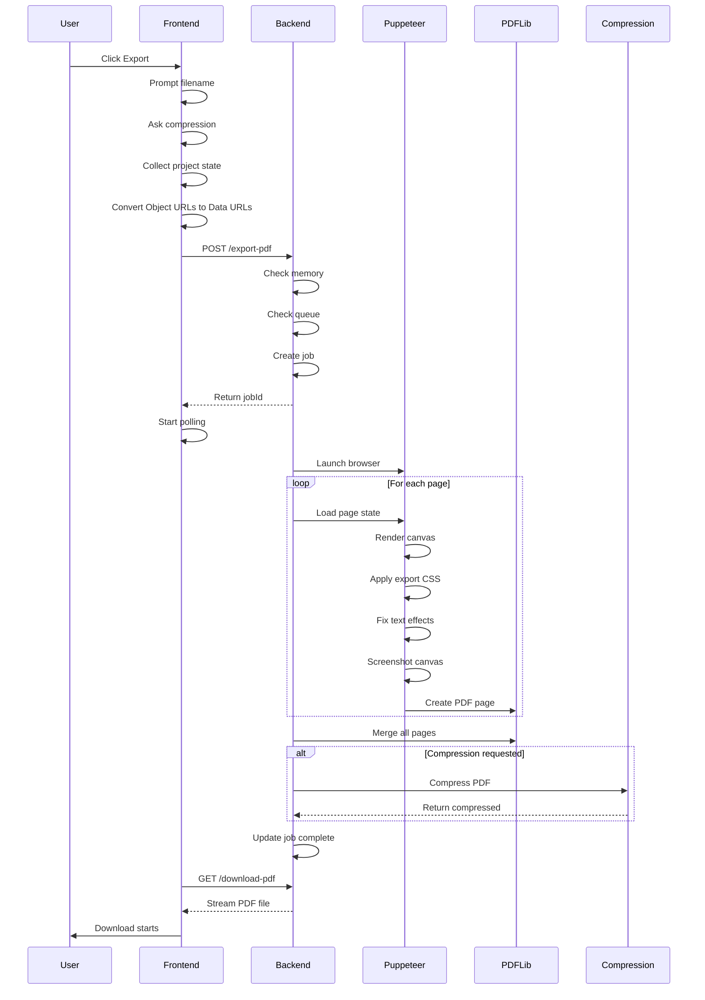

# Comic Pro - Complete Export Functionality Documentation

## Table of Contents
1. [Export Architecture Overview](#export-architecture-overview)
2. [Frontend Export System](#frontend-export-system)
3. [Backend PDF Service](#backend-pdf-service)
4. [Visual Element Preservation](#visual-element-preservation)
5. [Export Process Flow](#export-process-flow)
6. [Code Components](#code-components)

## Export Architecture Overview

The Comic Pro export system consists of two main components:
- **Frontend Client**: Initiates export, manages UI progress, handles job polling
- **Backend Service**: Puppeteer-based PDF generation with compression support

### System Flow
```
User → Frontend UI → Backend API → Puppeteer → PDF Generation → Compression → Download
```

## Frontend Export System

### Client-Side Text Preprocessing

**Key Principle**: Preserve exact text positioning from editor view by using minimal CSS overrides.

#### Text Position Preservation Strategy

1. **Minimal CSS Overrides** (`main.css:5817-5834`)
   - Only override what's necessary (transforms, padding, margins)
   - Don't override display or vertical-align properties
   - Let JavaScript-applied inline styles remain

2. **JavaScript Inline Styles** (`TextManagerUtils.js:241-246`)
   ```javascript
   // These styles are applied directly to text elements
   textContent.style.margin = '0';
   textContent.style.padding = '0';
   textContent.style.lineHeight = textState.style.lineHeight || 'normal';
   textContent.style.display = 'inline-block';  // CRITICAL: Don't override in export CSS
   textContent.style.whiteSpace = 'pre-wrap';
   textContent.style.textRendering = 'geometricPrecision';
   ```

3. **Export CSS Rules**
   ```css
   .exporting .text-bubble .text-content {
       /* Minimal overrides only */
       transform: none !important;
       position: relative !important;
       padding: 0.5px 2px 4.5px 2px !important;
       margin: 0 !important;
       /* Don't override display or vertical-align */
   }
   ```

### 1. Export Initiation (`src/js/main.js:749-816`)

**Download Button Handler**
```javascript
// Location: main.js:749-816
downloadBtn.addEventListener('click', async () => {
    // 1. Prompt for filename
    const filename = await this.promptForFilename("MyComic", ".pdf");
    
    // 2. Ask about compression
    const compressionChoice = await this.uiManager.showCompressionChoiceModal();
    const shouldCompress = compressionChoice === "Yes";
    
    // 3. Show export progress UI
    this.uiManager.showExportProgress('Starting PDF export...', 0);
    
    // 4. Prepare viewport (reset zoom/pan)
    this.viewportManager.prepareForExport();
    
    // 5. Get complete project state
    const projectState = await this.getCurrentProjectState();
    projectState.comicName = comicName;
    projectState.shouldCompress = shouldCompress;
    
    // 6. Send to backend
    const initiateResponse = await fetch(config.endpoints.exportPdf, {
        method: 'POST',
        headers: { 'Content-Type': 'application/json' },
        body: JSON.stringify(projectState)
    });
    
    // 7. Start polling for progress
    this.pollExportProgress(jobDetails.jobId, jobDetails.totalPages);
});
```

### 2. Project State Collection (`src/js/main.js:1749-1822`)

**getCurrentProjectState() Method**
```javascript
async getCurrentProjectState() {
    // Force save current page state
    this.saveCurrentPageState();
    
    // Collect custom layouts used in pages
    const customLayoutIds = new Set();
    this.pages.forEach(page => {
        if (page.layout?.startsWith('custom-')) {
            customLayoutIds.add(page.layout);
        }
    });
    
    // Convert Object URLs to Data URLs for persistence
    const imageProcessingPromises = this.imageLibrary.images.map(async img => {
        if (img.src.startsWith('blob:')) {
            const response = await fetch(img.src);
            const blob = await response.blob();
            const dataUrl = await new Promise((resolve) => {
                const reader = new FileReader();
                reader.onloadend = () => resolve(reader.result);
                reader.readAsDataURL(blob);
            });
            return { ...img, src: dataUrl };
        }
        return img;
    });
    
    const projectState = {
        version: '1.4-dimensions',
        canvasDimensionKey: this.selectedCanvasDimension,
        canvasWidth: this.canvasWidth,
        canvasHeight: this.canvasHeight,
        useGlobalBackgroundStyle: this.useGlobalBackgroundStyle,
        globalBackgroundStyle: this.globalBackgroundStyle,
        pages: this.pages,
        images: await Promise.all(imageProcessingPromises),
        currentPageIndex: this.currentPageIndex,
        folderStructure: this.folderStructure,
        customLayouts: customLayouts
    };
    
    return projectState;
}
```

### 3. Client-Side Manual Export (`ClientExportManager.js`)

**Manual Export Process** (when backend is unavailable)

#### Text Element Preprocessing

```javascript
preprocessForExport() {
    const textBubbles = document.querySelectorAll('#comic-canvas .text-bubble');
    
    textBubbles.forEach(bubble => {
        const textContent = bubble.querySelector('.text-content');
        if (textContent) {
            // Handle text shadows
            if (textContent.getAttribute('data-has-shadow') === 'true') {
                const shadowX = textContent.getAttribute('data-shadow-x') || '2';
                const shadowY = textContent.getAttribute('data-shadow-y') || '2';
                const shadowBlur = textContent.getAttribute('data-shadow-blur') || '2';
                const shadowColor = textContent.getAttribute('data-shadow-color') || '#666666';
                
                const shadowValue = `${shadowX}px ${shadowY}px ${shadowBlur}px ${shadowColor}`;
                textContent.style.setProperty('--export-text-shadow', shadowValue);
                textContent.style.textShadow = shadowValue;
            }
            
            // Handle text outlines
            if (textContent.getAttribute('data-has-outline') === 'true') {
                const outlineColor = textContent.getAttribute('data-outline-color') || '#000000';
                const outlineThickness = textContent.getAttribute('data-outline-thickness') || '1';
                
                textContent.style.webkitTextStrokeWidth = `${outlineThickness}px`;
                textContent.style.webkitTextStrokeColor = outlineColor;
            }
        }
    });
}
```

#### Key Points:
- **Preserve inline styles**: Don't override `display: inline-block` set by TextManagerUtils
- **Minimal CSS overrides**: Only reset transforms and ensure consistent padding
- **Data attributes**: Use data-* attributes to store and apply text effects
- **Cleanup after export**: Restore original styles to prevent editor corruption

### 4. Progress Polling (`src/js/main.js:900-951`)

**pollExportProgress() Method**
```javascript
pollExportProgress(jobId, totalPages) {
    const progressInterval = setInterval(async () => {
        const progressResponse = await fetch(config.endpoints.exportProgress(jobId));
        const progressData = await progressResponse.json();
        const percentage = Math.round((progressData.currentPage / totalPages) * 100);
        
        switch(progressData.status) {
            case 'processing':
                this.uiManager.updateExportProgress(
                    `Processing page ${progressData.currentPage} of ${totalPages}...`, 
                    percentage, totalPages
                );
                break;
            case 'merging':
                this.uiManager.updateExportProgress('Finalizing PDF...', 99, totalPages);
                break;
            case 'compressing':
                this.uiManager.updateExportProgress(
                    'Compressing PDF... This may take a few minutes.', 
                    100, totalPages
                );
                break;
            case 'complete':
                clearInterval(progressInterval);
                window.location.href = config.endpoints.downloadPdf(jobId);
                this.viewportManager.restoreAfterExport();
                break;
            case 'error':
                clearInterval(progressInterval);
                this.uiManager.updateExportProgress(`Error: ${progressData.error}`, 0, totalPages, true);
                this.viewportManager.restoreAfterExport();
                break;
        }
    }, config.export.progressPollInterval);
}
```

### 4. UI Progress Management (`src/js/modules/UIManager.js:383-470`)

**Export Progress UI Methods**
```javascript
// Show progress indicator
showExportProgress(message, percentage, totalPages) {
    if (!this.exportProgressElement) {
        this.exportProgressElement = document.createElement('div');
        this.exportProgressElement.id = 'export-progress-indicator';
        this.exportProgressElement.className = 'export-progress-indicator';
        document.body.appendChild(this.exportProgressElement);
    }
    this.updateExportProgress(message, percentage, totalPages);
    this.exportProgressElement.classList.add('show');
}

// Update progress display
updateExportProgress(message, percentage, totalPages, isError = false, jobStatus = null) {
    this.exportProgressElement.innerHTML = '';
    
    const textElement = document.createElement('div');
    textElement.className = 'progress-text';
    textElement.innerHTML = message;
    this.exportProgressElement.appendChild(textElement);
    
    if (totalPages > 0 && !isError) {
        const progressBar = document.createElement('div');
        progressBar.className = 'progress-bar';
        progressBar.style.width = `${percentage}%`;
        this.exportProgressElement.appendChild(progressBar);
    }
    
    // Apply status classes
    if (isError) {
        this.exportProgressElement.classList.add('error');
    } else if (percentage === 100) {
        this.exportProgressElement.classList.add('success');
    }
}
```

### 5. Viewport Management (`src/js/modules/ViewportManager.js:632-656`)

**Export Viewport Preparation**
```javascript
// Reset viewport for consistent export
prepareForExport() {
    // Save current state
    this.preExportState = {
        zoom: this.zoom,
        panX: this.panX,
        panY: this.panY
    };
    // Reset to default view
    this.resetView();
}

// Restore after export
restoreAfterExport() {
    if (this.preExportState) {
        this.zoom = this.preExportState.zoom;
        this.panX = this.preExportState.panX;
        this.panY = this.preExportState.panY;
        this.applyTransform();
        this.preExportState = null;
    }
}
```

## Backend PDF Service

### 1. Export Queue System (`comic-pro-pdf-service-deploy/src/puppeteer-export.js:23-68`)

**Memory-Optimized Queue**
```javascript
class ExportQueue {
    constructor() {
        this.queue = [];
        this.processing = false;
        this.maxConcurrent = 1; // Only 1 export at a time for 1GB memory
    }
    
    async add(jobFunction) {
        return new Promise((resolve, reject) => {
            this.queue.push({ execute: jobFunction, resolve, reject });
            this.processNext();
        });
    }
    
    async processNext() {
        if (this.processing || this.queue.length === 0) return;
        
        this.processing = true;
        const job = this.queue.shift();
        
        try {
            const result = await job.execute();
            job.resolve(result);
        } catch (error) {
            job.reject(error);
        } finally {
            this.processing = false;
            if (this.queue.length > 0) {
                setImmediate(() => this.processNext());
            }
        }
    }
}
```

### 2. API Endpoint Handler (`puppeteer-export.js:831-1054`)

**POST /export-pdf Endpoint**
```javascript
router.post('/export-pdf', async (req, res) => {
    // Memory checks
    const memUsage = process.memoryUsage();
    const memUsageMB = { rss: Math.round(memUsage.rss / 1024 / 1024) };
    
    if (memUsageMB.rss > 800) {
        return res.status(503).json({ 
            error: 'Server temporarily overloaded',
            memoryUsage: memUsageMB
        });
    }
    
    // Queue checks
    const queueLength = exportQueue.getQueueLength();
    if (queueLength >= 3) {
        return res.status(503).json({ 
            error: 'Server is busy',
            queueLength: queueLength
        });
    }
    
    // Create job
    const jobId = uuidv4();
    const totalPages = projectState.pages.length;
    
    exportJobs[jobId] = {
        id: jobId,
        status: 'queued',
        currentPage: 0,
        totalPages: totalPages,
        finalPdfPath: null,
        compressionInfo: null,
        error: null
    };
    
    // Respond immediately
    res.status(202).json({ 
        jobId: jobId,
        totalPages: totalPages
    });
    
    // Queue the export task
    exportQueue.add(async () => {
        // Process pages in batches
        const BATCH_SIZE = 5;
        for (let i = 0; i < totalPages; i += BATCH_SIZE) {
            // Process batch
            for (let j = i; j < Math.min(i + BATCH_SIZE, totalPages); j++) {
                const singlePageState = createSinglePageProjectState(projectState, j);
                await capturePageAsImage(comicCreatorUrl, jobOutputDir, singlePageState, tempPdfPath);
            }
            // Force garbage collection between batches
            if (global.gc) global.gc();
        }
        
        // Merge PDFs
        await mergePdfs(individualPdfPaths, finalPdfPath);
        
        // Optional compression
        if (projectState.shouldCompress) {
            const compressionResult = await pdfCompressionService.compressPDF(
                finalPdfPath, compressedPdfPath, compressionOptions
            );
            exportJobs[jobId].compressionInfo = compressionResult;
        }
        
        exportJobs[jobId].status = 'complete';
    });
});
```

### 3. Puppeteer Page Capture (`puppeteer-export.js:140-795`)

**capturePageAsImage() Function**
```javascript
async function capturePageAsImage(comicCreatorUrl, outputDirectory, projectState, outputPdfPath) {
    // Browser configuration for low memory
    const browser = await puppeteer.launch({
        headless: "new",
        executablePath: chromeExecutablePath,
        args: [
            '--no-sandbox',
            '--disable-setuid-sandbox',
            '--disable-dev-shm-usage',
            '--disable-gpu',
            '--max_old_space_size=512',
            '--single-process',
            '--no-zygote'
        ],
        defaultViewport: { width: 1280, height: 800 }
    });
    
    const page = await browser.newPage();
    
    // Set export flag before navigation
    await page.evaluateOnNewDocument(() => {
        window.IS_PUPPETEER_EXPORT = true;
    });
    
    // Navigate and wait for page
    await page.goto(comicCreatorUrl, { 
        waitUntil: ['networkidle0', 'domcontentloaded', 'load']
    });
    
    // Wait for comic canvas
    await page.waitForFunction(() => {
        const canvas = document.querySelector('#comic-canvas');
        return canvas && window.getComputedStyle(canvas).display !== 'none';
    });
    
    // Inject export-specific CSS
    await page.addStyleTag({
        content: EXPORT_CSS // See Visual Element Preservation section
    });
    
    // Load project state
    await page.exposeFunction('getPuppeteerProjectState', () => JSON.stringify(projectState));
    await page.evaluate(async () => {
        const projectStateJSON = await window.getPuppeteerProjectState();
        const state = JSON.parse(projectStateJSON);
        await window.comicCreator._loadProjectFromState(state);
    });
    
    // Wait for rendering
    await page.evaluate(async () => {
        const images = Array.from(document.images);
        await Promise.all(images.map(img => {
            if (img.complete) return Promise.resolve();
            return new Promise(resolve => {
                img.onload = resolve;
                img.onerror = resolve;
            });
        }));
    });
    
    // Apply text shadow fixes
    await page.evaluate(() => {
        const textElements = document.querySelectorAll('.text-content[data-has-shadow="true"]');
        textElements.forEach(element => {
            const shadowValue = `${element.getAttribute('data-shadow-x')}px ` +
                               `${element.getAttribute('data-shadow-y')}px ` +
                               `${element.getAttribute('data-shadow-blur')}px ` +
                               `${element.getAttribute('data-shadow-color')}`;
            element.style.setProperty('--export-text-shadow', shadowValue);
            element.style.textShadow = shadowValue;
        });
    });
    
    // Get canvas bounding box
    const boundingBox = await page.evaluate(() => {
        const canvas = document.querySelector('#comic-canvas');
        const rect = canvas.getBoundingClientRect();
        return {
            x: Math.round(rect.left),
            y: Math.round(rect.top),
            width: Math.round(rect.width),
            height: Math.round(rect.height)
        };
    });
    
    // Take screenshot
    const pngScreenshotBuffer = await page.screenshot({
        clip: boundingBox,
        type: 'png',
        omitBackground: false
    });
    
    // Create PDF with screenshot
    const pdfDoc = await PDFDocument.create();
    const pdfPage = pdfDoc.addPage([projectState.canvasWidth, projectState.canvasHeight]);
    const pngImage = await pdfDoc.embedPng(pngScreenshotBuffer);
    
    pdfPage.drawImage(pngImage, {
        x: 0,
        y: 0,
        width: projectState.canvasWidth,
        height: projectState.canvasHeight
    });
    
    const pdfBytes = await pdfDoc.save();
    await fs.writeFile(outputPdfPath, pdfBytes);
    
    // Cleanup
    await page.close();
    await browser.close();
    if (global.gc) global.gc();
    
    return outputPdfPath;
}
```

## Visual Element Preservation

### Export-Specific CSS

**Key Principle**: Use minimal overrides to preserve exact positioning from editor view.

```css
/* Canvas positioning */
#comic-canvas {
    transform: none !important;
    transition: none !important;
    opacity: 1 !important;
    visibility: visible !important;
    display: block !important;
}

/* Text bubbles */
body.exporting .text-bubble,
.text-bubble.exporting-direct-style {
    transform-origin: center center !important;
    transition: none !important;
    opacity: 1 !important;
    visibility: visible !important;
}

/* Text content positioning (main.css lines 5817-5834) */
.exporting .text-bubble .text-content {
    /* Minimal overrides - let normal styles apply */
    transform: none !important;
    position: relative !important;
    
    /* Match exact padding from normal view */
    padding: 0.5px 2px 4.5px 2px !important;
    margin: 0 !important;
    
    /* IMPORTANT: Don't override display or vertical-align */
    /* TextManagerUtils.js sets display: inline-block */
    /* Let JavaScript-applied inline styles remain */
}

/* Text content with outline */
.text-content[data-has-outline="true"] {
    -webkit-text-stroke-width: var(--stroke-width, 1px) !important;
    -webkit-text-stroke-color: var(--stroke-color, #000000) !important;
    -webkit-text-fill-color: currentColor !important;
    -webkit-font-smoothing: antialiased !important;
    text-rendering: optimizeLegibility !important;
}

/* Text content with shadow */
.text-content[data-has-shadow="true"] {
    text-shadow: var(--export-text-shadow) !important;
}

/* Stickers */
.canvas-sticker-image {
    transform-origin: center center !important;
    transition: none !important;
    opacity: 1 !important;
    visibility: visible !important;
}

/* Panel images */
.comic-panel img {
    transition: none !important;
    opacity: 1 !important;
    visibility: visible !important;
}

/* Background images */
.canvas-background-image {
    transition: none !important;
    opacity: 1 !important;
    visibility: visible !important;
}
```

### Visual Elements Preserved

1. **Comic Panels**
   - Panel layout (standard/custom)
   - Panel images with zoom/position/rotation
   - Panel borders and styles

2. **Text Elements**
   - Text bubbles with all bubble types (speech, thought, shout, etc.)
   - Rich text formatting (font, size, color, bold, italic, underline)
   - Text outlines (stroke width and color)
   - Text shadows (x, y, blur, color)
   - Custom Google Fonts
   - Text rotation and positioning

3. **Stickers**
   - Sticker images
   - Position, size, rotation
   - Z-index layering

4. **Backgrounds**
   - Global background styles
   - Per-page background images
   - Background patterns and colors

5. **Canvas Properties**
   - Canvas dimensions (Square, Amazon KDP, Landscape)
   - Custom canvas sizes
   - Page margins and spacing

## Export Process Flow

### Complete Export Sequence



## Code Components

### Frontend Files
- `src/js/main.js` - Main orchestrator with export initiation
- `src/js/modules/UIManager.js` - Progress UI management
- `src/js/modules/ViewportManager.js` - Viewport state management
- `src/client/pdf-export-manager.js` - Export coordination (alternative)
- `src/client/pdf-export-progress.js` - Progress UI component
- `src/client/pdf-export-tracker.js` - Job polling tracker
- `src/js/config.js` - API endpoints configuration

### Backend Files
- `comic-pro-pdf-service-deploy/server.js` - Express server
- `comic-pro-pdf-service-deploy/src/puppeteer-export.js` - PDF generation engine
- `comic-pro-pdf-service-deploy/src/pdf-compression.js` - iLovePDF compression

### Key Functions

**Frontend**
- `ComicCreator.getCurrentProjectState()` - Collects complete project data
- `ComicCreator.pollExportProgress()` - Monitors export job
- `UIManager.showExportProgress()` - Shows progress UI
- `UIManager.updateExportProgress()` - Updates progress display
- `ViewportManager.prepareForExport()` - Resets viewport
- `ViewportManager.restoreAfterExport()` - Restores viewport

**Backend**
- `capturePageAsImage()` - Renders page with Puppeteer
- `createSinglePageProjectState()` - Isolates page data
- `mergePdfs()` - Combines individual PDFs
- `ExportQueue.add()` - Queues export job
- `pdfCompressionService.compressPDF()` - Compresses final PDF

### API Endpoints

```javascript
// Start export
POST /api/export-pdf
Body: { projectState, shouldCompress }
Response: { jobId, totalPages }

// Check progress
GET /api/export-progress/:jobId
Response: { status, currentPage, totalPages, compressionInfo }

// Download PDF
GET /api/download-pdf/:jobId
Response: PDF file stream
```

### Memory Management

1. **Frontend**
   - Converts Object URLs to Data URLs before sending
   - Clears references after export
   - Manages single export at a time

2. **Backend**
   - Single concurrent export limit
   - Batch processing (5 pages at a time)
   - Forced garbage collection between batches
   - Memory threshold checks (800MB limit)
   - PM2 auto-restart at 800MB
   - Job cleanup after 1 hour

### Error Handling

1. **Frontend Errors**
   - Network failures
   - Polling timeouts
   - Invalid project state
   - User cancellation

2. **Backend Errors**
   - Memory exceeded
   - Queue full
   - Puppeteer crashes
   - Compression failures
   - File system errors

All errors are tracked in job status and reported to frontend via polling.

## Configuration

### Environment Variables

**Frontend (.env)**
```bash
VITE_API_BASE_URL=http://localhost:3001/api  # Backend URL
```

**Backend (.env)**
```bash
COMIC_CREATOR_URL=https://comic-pro.vercel.app
ILOVEPDF_PUBLIC_KEY=your_key
ILOVEPDF_SECRET_KEY=your_secret
NODE_ENV=production
PORT=3001
EXPORT_OUTPUT_DIR=./exports
PUPPETEER_EXECUTABLE_PATH=/usr/bin/google-chrome
```

### Export Settings

```javascript
// config.js
export: {
    progressPollInterval: 1000,  // 1 second
    maxExportSize: 100,          // Max pages
    compressionLevel: 'recommended'
}
```

## Testing Export

### Manual Testing Checklist

1. **Basic Export**
   - [ ] Export single page
   - [ ] Export multiple pages
   - [ ] Export with custom layouts
   - [ ] Export with/without compression

2. **Visual Elements**
   - [ ] Text with all formatting options
   - [ ] Text with outlines
   - [ ] Text with shadows
   - [ ] All bubble types
   - [ ] Rotated text
   - [ ] Panel images with transformations
   - [ ] Stickers at various positions
   - [ ] Background images/styles

3. **Edge Cases**
   - [ ] Empty pages
   - [ ] Pages with only text
   - [ ] Pages with only images
   - [ ] Maximum page count
   - [ ] Network interruption during export
   - [ ] Server restart during export

### Debug Commands

```bash
# Check backend memory
pm2 status

# View export logs
npm run pm2:logs | grep Export

# Test Puppeteer
node -e "require('puppeteer').launch().then(b => { console.log('OK'); b.close(); })"

# Check Chrome installation
google-chrome --version
```

## Troubleshooting

### Common Issues

1. **Export Fails Immediately**
   - Check backend is running: `pm2 status`
   - Verify CORS settings match frontend URL
   - Check memory usage: `free -h`

2. **Text Not Rendering Correctly**
   - Ensure fonts are loaded before export
   - Check text shadow/outline data attributes
   - Verify export CSS is applied
   - **Text Position Issues**: Ensure export CSS doesn't override display/vertical-align
   - **Conflicting Styles**: Use minimal CSS overrides (only transforms, padding, margins)
   - **Check Inline Styles**: Preserve JavaScript-applied styles (display: inline-block)

3. **Images Missing**
   - Confirm Object URLs converted to Data URLs
   - Check image loading timeout
   - Verify project state includes all images

4. **Memory Errors**
   - Reduce batch size in backend
   - Increase server memory
   - Enable swap space

5. **Compression Fails**
   - Verify iLovePDF credentials
   - Check network connectivity
   - Fallback to uncompressed works

### Performance Optimization

1. **Frontend**
   - Minimize project state size
   - Compress images before upload
   - Limit concurrent exports

2. **Backend**
   - Adjust batch size based on memory
   - Optimize Puppeteer args
   - Use CDN for static assets
   - Implement caching for repeated exports

## Summary

The Comic Pro export system successfully preserves all visual elements through a sophisticated pipeline:

1. **Complete State Capture**: All panels, text, stickers, backgrounds, and layouts
2. **Accurate Rendering**: Puppeteer renders exactly as seen in editor
3. **Effect Preservation**: Text outlines, shadows, rotations maintained
4. **Memory Efficiency**: Queue system and batching for 1GB servers
5. **Robust Error Handling**: Graceful fallbacks and detailed status tracking
6. **Optional Compression**: Reduces file size while maintaining quality

The system ensures pixel-perfect PDF exports of comic books with all creative elements intact.